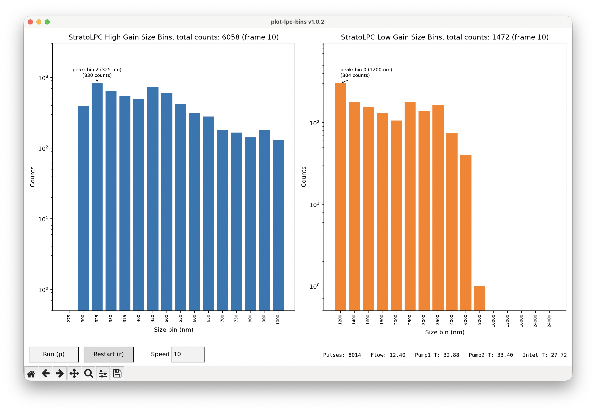

# plot-lpc-bins

Live plots of Strateole 2 LPC data from the instrument's serial console or from a saved console log: the StratoLPC high-gain and low-gain size bins, plus the PHA board's raw pulse-height spectra, with a status bar of housekeeping values.



## Quickstart

Requires Python 3.8 or newer. Dependencies (`pyserial`, `matplotlib`) are installed automatically.

**Install from GitHub**

```
pip install "git+https://github.com/kalnajslab-org/StratoCore_LPC.git#subdirectory=plot_lpc"
```

The package lives in the `plot_lpc` subdirectory of the repo, hence `#subdirectory=plot_lpc`. Add `@<branch-or-tag>` after `.git` to install something other than the default branch. If you use SSH keys with GitHub, use `git+ssh://git@github.com/kalnajslab-org/StratoCore_LPC.git#subdirectory=plot_lpc` instead.

**Install from a local clone**

```
git clone git@github.com:kalnajslab-org/StratoCore_LPC.git
pip install ./StratoCore_LPC/plot_lpc
```

Use `pip install -e ./StratoCore_LPC/plot_lpc` if you want edits to the source to take effect without reinstalling.

Install into a virtual environment or with `pipx install ...` if you'd rather not touch your main Python.

**Updating**

Re-run the install command with `--upgrade`:

```
pip install --upgrade "git+https://github.com/kalnajslab-org/StratoCore_LPC.git#subdirectory=plot_lpc"
```

Pip decides what is newer from the `version` in `pyproject.toml`, so a new version has to be published with a bumped version number to be picked up. If you know the code changed but the version didn't, add `--force-reinstall` (and `--no-deps` to skip reinstalling matplotlib and pyserial). With pipx, use `pipx upgrade plot-lpc-bins`.

For a local clone, `git pull` and run `pip install --upgrade ./StratoCore_LPC/plot_lpc` again. An editable install (`-e`) needs only the `git pull`, unless the commands in `pyproject.toml` changed.

**Run it**

```
# read live from the LPC board's debug console
plot-lpc-bins --port /dev/tty.usbmodemXXXX --baud 115200

# or replay a saved console log (paced at 10x real time by default)
plot-lpc-bins --file LPC_DBG_2026-10-02T11-00-32.txt
```

The command is `plot-lpc-bins` (hyphens). `python -m plot_lpc_bins` works too.

## Input sources

| Option | Reads from |
|---|---|
| `--port PORT [--baud N]` | A live serial port (default 115200 baud; use 500000 for the PHA's own Serial1 output). |
| `--file PATH` | A saved log file, replayed. |
| `--file -` | Standard input, e.g. `cat log.txt \| plot-lpc-bins --file -`. |

Lines are auto-detected one at a time, so any mix of the formats below can appear on the same stream. A `[HH:MM:SS.mmm] ` timestamp prefix, as written by the logger, is ignored.

| Format | Where it comes from | Plotted in |
|---|---|---|
| `HGBINS,<record>,<16 values>` and `LGBINS,<record>,<16 values>` | LPC board console (`StratoLPC::fillBins()`) | Top panels |
| `High Gain Bins: ...` / `Low Gain Bins: ...` | Older plain-text version of the same 16 bins | Top panels |
| `HG_Small_Array: ...` / `LG_Small_Array: ...` | PHA board USB console, after sending `#hgprint,1` and `#lgprint,1` to it | Bottom panels |
| `<timestamp>,<laserI>,<threshold>,<pulse_count>,<256 HG>,<256 LG>,E` | PHA board Serial1 line to the main board (500000 baud) | Bottom panels |
| `Pulse Count:`, `Flow:`, `Pump1 T:`, `Pump2 T:`, `Inlet T:` | LPC board console | Status bar |

Any other line is printed to the terminal unchanged, so you can still see the instrument's log messages. The five housekeeping lines go to the status bar and are not echoed.

## Playback controls

These appear when you use `--file`. A live `--port` has no controls, because pausing a serial stream would lose data.

| Control | Key | What it does |
|---|---|---|
| Pause / Run | `p` or space | Freezes and resumes playback. |
| Restart | `r` | Starts again from the beginning of the file and clears the plots. Not available with `--file -`, since a pipe can't be rewound. |
| Speed box | | Type a multiple of real time and press Enter, e.g. `20` or `0.5`. Blank, `0` or `max` replays as fast as possible. |

Playback is paced from the log's own timestamps. Periods where the instrument is idle or in standby (no size-bin data is produced) are skipped rather than waited out, so you don't sit through the minutes between measurements.

`--speed N` sets the starting speed (default **10**; `--speed 0` means unpaced). It is ignored with `--port`.

## What the plots show

The size-bin panels have 16 bars each. The x-axis is the bin's lower diameter edge in nm, as in the LPC data file header (where the columns are labelled `diam >nm`). The tallest bar is annotated with its bin number, size and count.

| Panel | Bins (nm) |
|---|---|
| High gain | 275, 300, 325, 350, 375, 400, 450, 500, 550, 600, 650, 700, 750, 800, 900, 1000 |
| Low gain | 1200, 1400, 1600, 1800, 2000, 2500, 3000, 3500, 4000, 6000, 8000, 10000, 13000, 16000, 24000, 24000 |

The last low-gain bin is always empty: its raw-array range in the firmware is 255 to 255, which is why 24000 appears twice.

The PHA panels stay empty ("no data yet") unless the stream includes the PHA's raw spectra. They are drawn with the largest pulse on the right and the bin nearest the trigger threshold on the left.

## Testing without hardware

`lpc-fake-port` creates a pseudo-terminal and feeds a saved log into it, so you can exercise the real `--port` path with no device attached:

```
# terminal 1: prints a port such as /dev/ttys012 and waits
lpc-fake-port LPC_DBG_2026-10-02T11-00-32.txt --speed 20

# terminal 2
plot-lpc-bins --port /dev/ttys012 --baud 115200

# then press Enter in terminal 1 to start sending
```

Options: `--speed N` (multiple of real time, default 1), `--loop` (repeat forever), `--no-wait` (don't wait for Enter).
